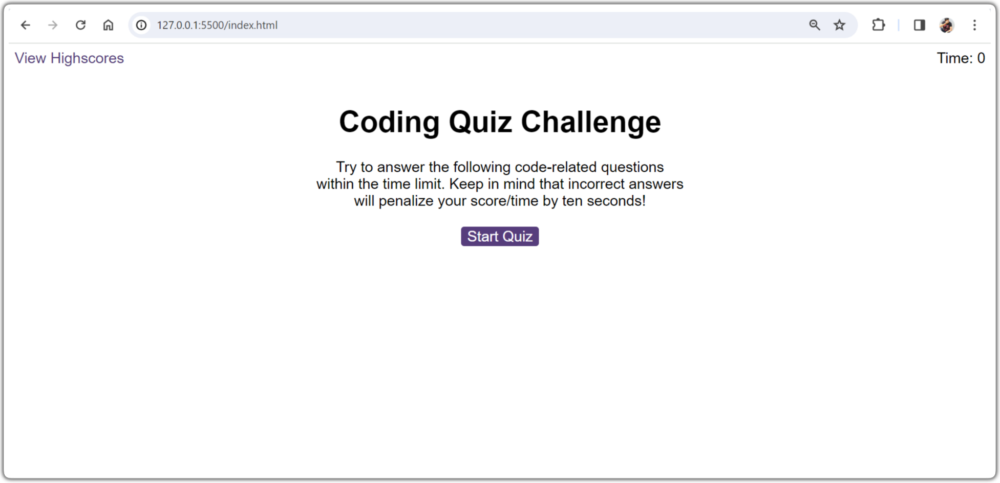
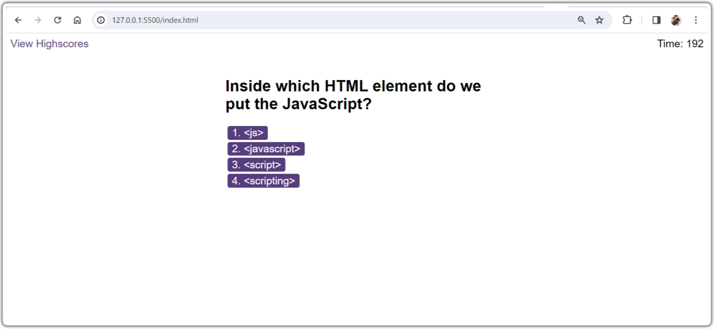
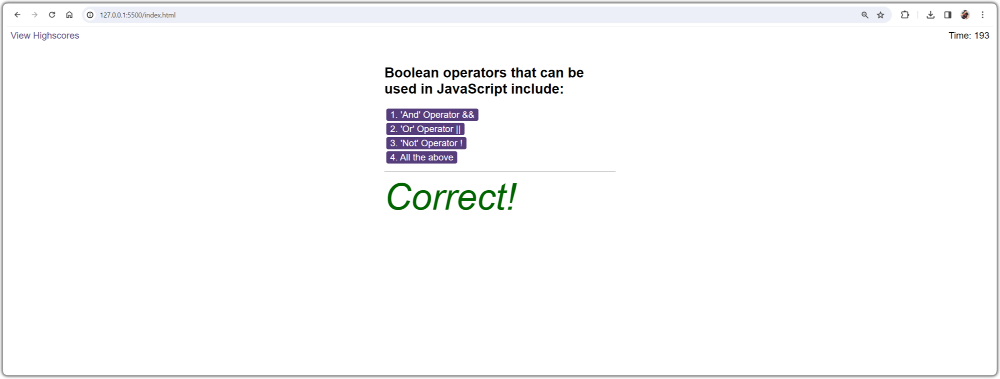
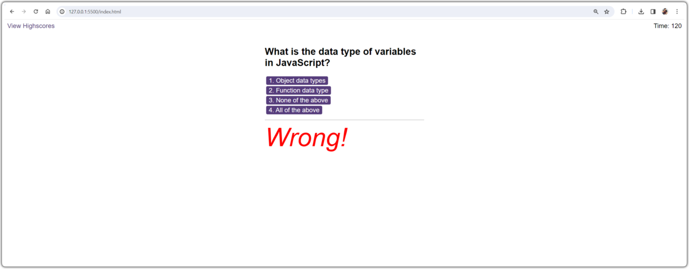
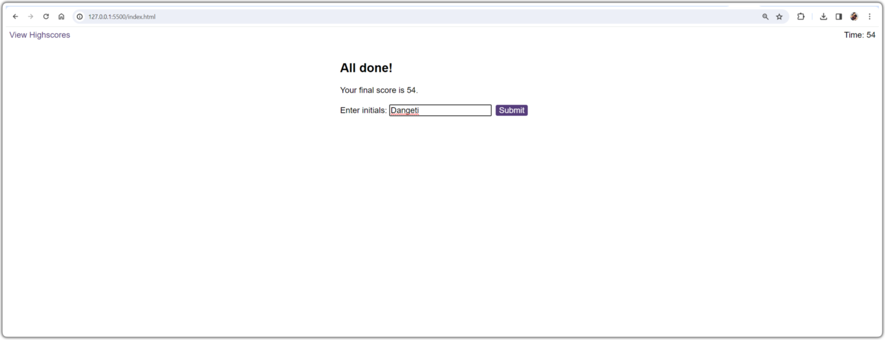
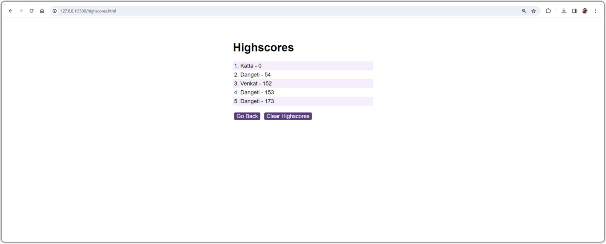
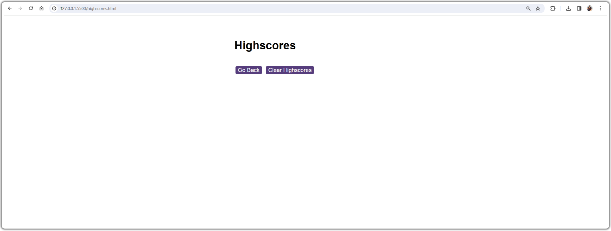

# Web APIs: Code Quiz


## Task

As we proceed in your journey to becoming a front-end web developer, it’s likely that you’ll be asked to complete a coding assessment, perhaps as part of an interview process. A typical coding assessment is a combination of multiple-choice questions and interactive coding challenges. 


## User Story

```
AS A coding boot camp student
I WANT to take a timed quiz on JavaScript fundamentals that stores high scores
SO THAT I can gauge my progress compared to my peers
```

## Acceptance Criteria

Create a code quiz that contains the following requirements:

* A start button that when clicked a timer starts and the first question appears.
 
  * Questions contain buttons for each answer.
  * 
  * When answer is clicked, the next question appears
  * 
  * If the answer clicked was incorrect then subtract time from the clock

* The quiz should end when all questions are answered or the timer reaches 0.

  * When the game ends, it should display their score and give the user the ability to save their initials and their score


Final code should print the functionality.


## Final Screens

Home Page : 

Questions Page : 

Correct answer Page : 

Wrong answer Page : 

Initial details Page : 

Highscores Page : 

Clear highscores Page : 


## Git Hub page - https://github.com/venkatdangeti/WebAPI-Code-Quiz.git

## deployed site page - https://venkatdangeti.github.io/WebAPI-Code-Quiz/


